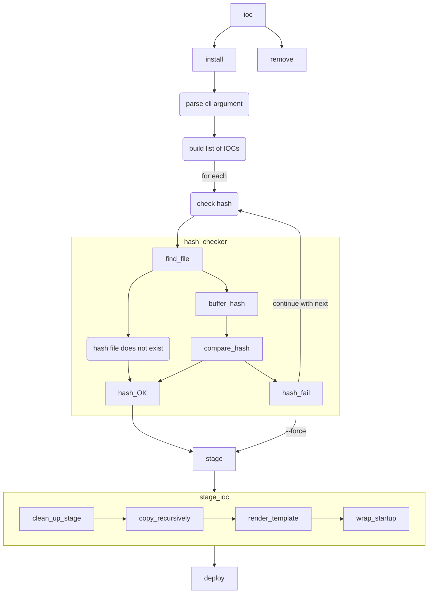

# ioc

This tool allows you to deploy IOC applications.
Currently, the tool is only available for testing.
The deployment will write to `./deploy/ioc/${IOC}`.
At deployment a hash will be generated and stored in `./deploy/ioc/data/${IOC}/hash`

## License
MIT or GPLv3 License

## Prerequisites

- app configuration in `/opt/apps/ioc/config/default.{yaml,toml,json}`

## Configuration
Default config is mandatory in `/opt/apps/ioc/config/default.{yaml,toml,json}`.
This config is overridden if a `dev` file is found in `${PWD}/config/`.
Additionally, the `-c` argument can specify a file.

NOTE: Incremental changes are allowed. The sequence is default -> dev -> argument.

## `ioc install`

Install the IOC.
See `ioc install --help` for more information.

### process flow

#### check deployment destination

1. read hash from file
2. calculate the current checksum
3. compare against stored value
4. skip if mismatch (override with `--force`)

#### stage deployment
1. find source directory
2. copy source to staging directory
3. do the startup wrapping via a template

#### deployment
1. calculate the checksum and write to the destination
2. copy from staging directory to deploy directory

### TODO

- default to PWD if name not specified [implemented]
- test
- refactor to move functions to separate mods [implemented]
- ...

## flow chart

